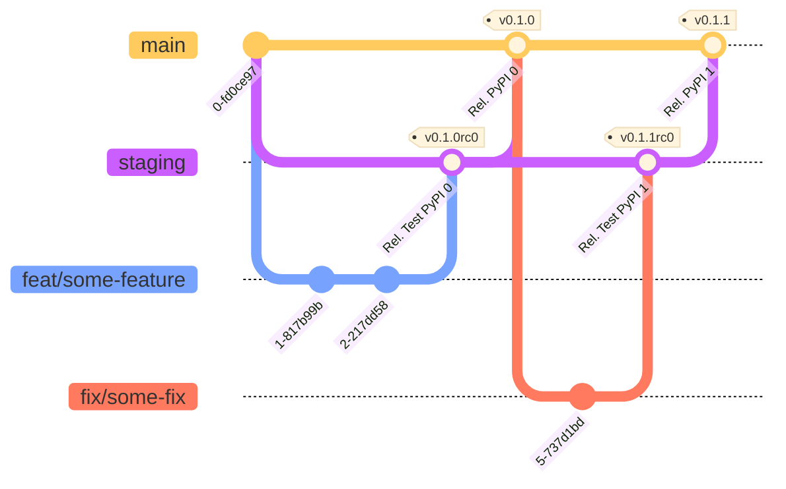

# Python package template

Template for Python packages for qurix Technology.

## Structure

A normal Python package will start with the namespace `qurix` as in this sample package. A sample structure is as follows:

```text
.
├── LICENCE
├── Makefile
├── README.md
├── qurix
│   └── <domain>
│       └── <module-organization-level>
│           ├── __init__.py
│           ├── __version__.py
│           └── <module>
├── requirements.txt
├── setup.py
└── tests
    ├── __init__.py
    └── test_module.py
```

## Versioning and release

Package versions will be identified according to [semantic versioning](https://semver.org/lang/en). The release process will deploy in both [Test PyPI](https://test.pypi.org/) and [PyPI](https://pypi.org/).



## Deployment

Automatic deployments via Github Actions. See `.github/worfklows/`